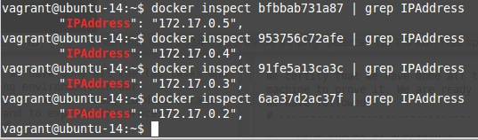

# Answers, Phase 1

```
# -- INSERT YOUR NAMES HERE -----
Nicolas Butticaz
Bastian Gardel

We certify that we have done all the lab tasks and we have a running environment on our 
machine to prove it. We are ready to demonstrate it at any time and to explain the process
we have followed.
# -------------------------------
```

```
# -- YOUR ANSWER TO QUESTION 1 --
vagrant up
```

```
# -- YOUR ANSWER TO QUESTION 2 --
vagrant ssh
uname -a
```


```
# -- YOUR ANSWER TO QUESTION 3 --
docker images
```

```
# -- YOUR ANSWER TO QUESTION 4 --
docker ps
```

```
# -- YOUR ANSWER TO QUESTION 5 --
We used docker inspect command to find ip address. The Ip address of dockers containers are :
    -172.17.0.2
    -172.17.0.3
    -172.17.0.4
    -172.17.0.5  
```

```
# -- YOUR ANSWER TO QUESTION 6 --

Host (your laptop):
- IP address: 192.168.43.73

Virtual Machine run by Virtual Box
- IP address: 192.168.33.20
- PAT: packets arriving on 192.168.43.73:9090 are forwarded to 192.168.33.20:8080

Docker Bridge
- IP address: 172.17.42.1
- PAT: packets arriving on 172.17.42.1:7070 are forwarded to 172.17.0.2:80
- PAT: packets arriving on 172.17.42.1:9090 are forwarded to 172.17.0.3:80
- PAT: packets arriving on 172.17.42.1:8081 are forwarded to 172.17.0.4:80
- PAT: packets arriving on 172.17.42.1:8082 are forwarded to 172.17.0.5:80

Docker Container 1
- IP address: 172.17.0.2

Docker Container 2
- IP address: 172.17.0.3

Docker Container 3
- IP address: 172.17.0.4

Docker Container 4
- IP address: 172.17.0.5

# -------------------------------
```

```
GET / HTTP/1.1
Host: www.monsys.com:9090
Connection: close

Which command did you type on the terminal to establish the connection?

telnet www.monsys.com 9090

What HTTP request did you type and send?
GET / HTTP/1.1
Host: www.monsys.com:9090
Connection: close

What HTTP response did you get?
    See print screen
```

```
GET /ajax/resources/nodes HTTP/1.1
Host: www.monsys.com:9090
Connection: close

Which command did you type on the terminal to establish the connection?
telnet www.monsys.com 9090

What HTTP request did you type and send?
GET /ajax/resources/nodes HTTP/1.1
Host: www.monsys.com:9090
Connection: close

What HTTP response did you get?
    See print screen
```

```
# -- YOUR ANSWER TO QUESTION 9 --

What procedure did you follow to validate the configuration of 
your new web nodes? 

Provide details and evidence (command results, etc.) that your 
setup is correct.
```
- 1)  we edited the Vagrantfile by changing the script variable and than by addind image and run :
 


- 2) we dupplicated the web apache file and renemed to web-clash. We added the 2 web site (live and dashboard) into site-content file. we created a conf file for each sites


- 3) we send an http request in a telnet session in vagrant vm.


```
# -- YOUR ANSWER TO QUESTION 10 --

What procedure did you follow to validate the configuration of 
your complete infrastructure?

Provide details and evidence (command results, etc.) that your 
setup is correct.


```

- 1) we edited the de default conf file of the nginx proxy.

First we added news ip adress into our pool nodes (web-clash).


Then we described the target pool of nodes for our web site URL 


-    2) we edited vagrant file. we replace the forward port 9090 by 80 and we replace the nginx port 9090 by 80.


-    3) we made a vagrant provision

-    4) we edited our local host file

        192.168.33.20   www.monsys.com
        192.168.33.20   live.clashofclasses.ch
        192.168.33.20   dashboard.clashofclasses.ch

-    5) we can make http request in our brower

